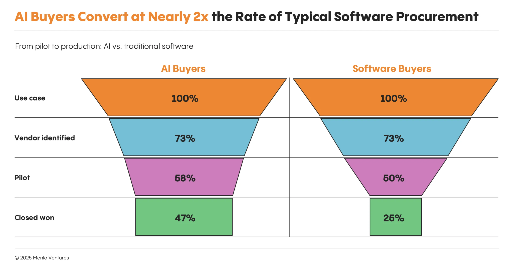
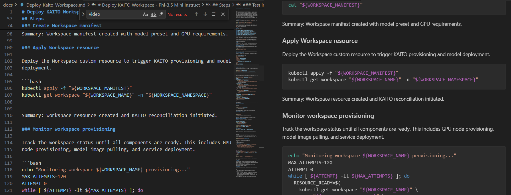
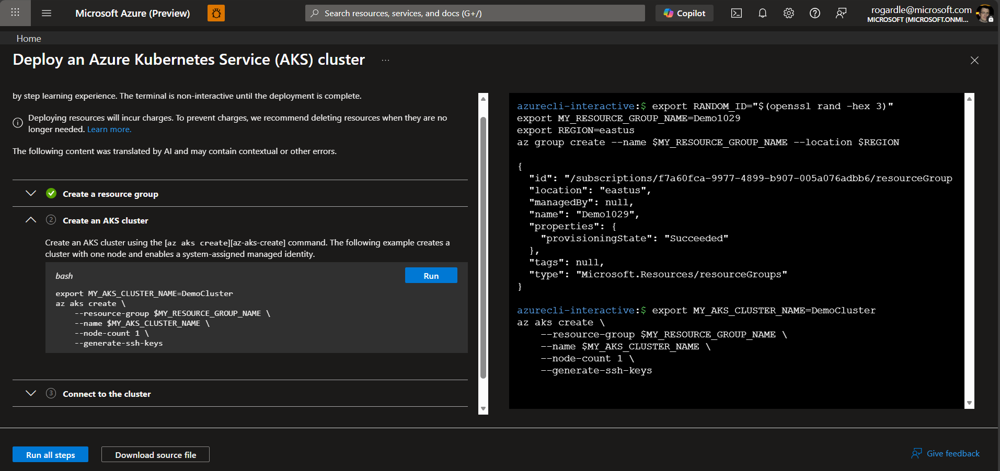

<!-- _class: lead -->

# Ship AI, Not Just Clusters

## End-to-End AI on AKS with KAITO

- For platform engineers & AI/ML practitioners on Azure
- Focus: **full E2E AI workloads**, not just operator install
- From empty subscription → running model → app-ready endpoint

---

## Agenda

### E2E AI workloads on AKS: what "good" looks like

1. Why onboarding is hard today
2. Executable docs as E2E playbooks
3. From zero → GPU-backed KAITO workspace
4. From workspace → app-facing endpoint
5. E2E examples for onboarding **and** retention
6. Where we are now and what’s next

---

https://menlovc.com/perspective/2025-the-state-of-generative-ai-in-the-enterprise/

## E2E Matters More Than Pieces

- Teams don't just want "KAITO installed" – they want:
  - A **application online**, doing real work
  - A **repeatable path** from idea → demo → production
  - Confidence they can **get back** to this state later
- E2E examples:
  - Reduce time-to-first-success
  - Anchor mental models
  - Become the **contract** between platform and app teams

Executable docs are how we encode those E2E stories.

---

## Poor Onboarding == Loss of User

- Long, manual sequences of CLI commands
- Prerequisites hidden behind assumptions
- Multiple failure points with no recovery guidance, for example:
  - Cluster created, but **no GPUs**
  - Operator enabled, but **workspace failing**
  - Endpoint deployed, but **URL undiscoverable**

**TL;DR Happy path works in testing, but fails in reality**

---

## Onboarding Path 1

### Deploy with Visual Studio Code (MS Learn)

Prerequisites in [Deploy and test inference models with the AI toolchain operator (KAITO) in Visual Studio Code](https://learn.microsoft.com/en-us/azure/aks/aks-extension-kaito) include:

    "Verify that your Azure subscription has GPU quota for your chosen model by checking the  KAITO model workspaces."

Which links to https://github.com/kaito-project/kaito/tree/main/presets where there is _ZERO_ guidance on what to do.

---

## Onboarding Path 2

### Deploy With Upstream Docs

Prerequisites in [Installation documentation](https://kaito-project.github.io/kaito/docs/installation/) on github has a 404 on the AKS instructions link.

Once the [page](https://kaito-project.github.io/kaito/docs/azure) is found it fails (at least for me) due to outdated instructions regarding identity management.

---

## Onboarding Path 3

### Deploy With CLI on MS Learn

Eventually I was directed by PM to [Deploy an AI model on Azure Kubernetes Service (AKS) with the AI toolchain operator add-on](https://learn.microsoft.com/en-us/azure/aks/ai-toolchain-operator) (NOTE: I did not find this through search.)

This is an Exec Doc but it _DOESN'T WORK!_

Since Exec Docs are self-testing, a non-working Exec Doc should be impossible.

---

# What's next?

Even if the customer works through all this and have Kaito deployed, what do they do with it?

Almost no "next steps" guidance - and what does exist has similar challenges.

_**E2E Matters More Than Pieces**_

---

# Why this matters

KAITO on AKS seeks to provide customers with more flexibility than Azure Foundry.

To succeed a user needs:

- K8s knowledge (e.g. extensive use of kubectl)
- AKS knowledge (e.g. identity management)
- Azure knowledge (e.g. GPU quota)
- LLM knowledge (e.g. which model?)
- Application authoring (e.g. hello world app)

That user profile is too narrow for true success.

---

## Enter _*(real)*_ Executable Docs

- A **single, repeatable, testable** E2E flow
  - **Onboarding path** for new users
  - **User acceptance tests** for the platform
  - **Reference implementations** for app teams
- Each doc captures:
  - Preconditions (env vars, tools, quota checks)
  - Dependencies (e.g. KAITO requires AKS cluster)
  - Idempotent commands (safe to rerun)
  - Automated testing against expected outputs

---

## Any CLI tool, including Terraform

- Terraform works too
- In fact almost all CLI tooling is supported

---

## Builds infrastructure in _**stages**_

- Users start with their first knowledge gap.
  1. **Workspace + Model** → `docs/Deploy_Kaito_Workspace.md`
  2. **KAITO Platform** → `docs/Install_Kaito_On_AKS.md`
  3. **AKS Cluster** → `docs/Create_AKS.md`
  4. **Quota** → `docs/Check_GPU_Quota_For_Kaito.md`
- Sub-documents are automatically exectued

---

<video width=99% controls>
  <source src="./video/Exec Docs - Kaito Demo.mp4" type="video/mp4">
</video>

---

## Publish to MS Learn

Exec Docs are standard markdown and can be published on MS Learn.

---

## Exceute in the Portal

Caveat: These docs require an update to the portal implementation

---

## From Workspace to Applications

Current state:

- Stable, testable KAITO endpoint
- Backed by GPU nodes provisioned on demand

Remaining gap to full E2E:

- Real app or service consuming the endpoint
- Production concerns:
  - Auth, rate limiting, multi-tenancy
  - Monitoring, scaling, cost controls

---

## E2E Examples for Onboarding

- "Can I deploy an LLM chat API on AKS?"
- "Can I build a RAG chatbot with vector search?"
- "Can I create agentic microservices with tool calling?"
- "Can I run a vision inference service on Kubernetes?"
- "Can I fine‑tune models on AKS using KAITO?"
- "Can I deploy a multimodal text‑image inference app?"
- "Can I schedule a batch embeddings pipeline with Jobs?"
- "Can I auto‑scale streaming anomaly detection with KEDA?"

Result: faster **time-to-first-success**.
